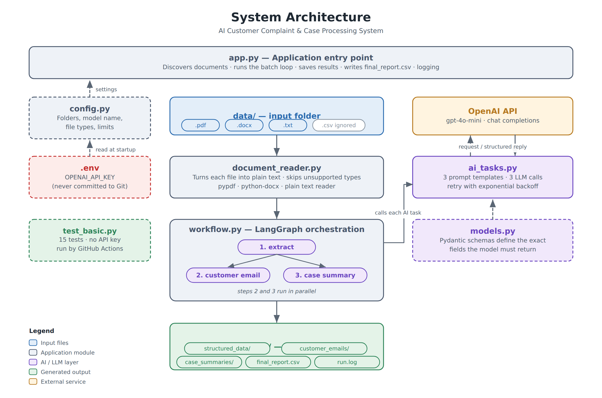

# AI Customer Complaint & Case Processing System

A GenAI-powered batch workflow that reads customer complaint documents from a folder and, for
each one, uses an LLM to extract structured case data, write a reply to the customer, and
write an internal summary for management — then consolidates the whole batch into one report.

Built with **Python, OpenAI, LangChain, LangGraph and Pydantic**.

Two ways to run it, both using the same pipeline:

| | Command | What it does |
|---|---|---|
| **Batch** | `python app.py` | Processes every document in `data/` and writes `output/` |
| **Web** | `streamlit run streamlit_app.py` | The same pipeline in a browser — this is what gets deployed |

*Final Project 1 — Certification Programme in Generative and Agentic AI Development*

---

## Table of contents

1. [Problem statement](#1-problem-statement)
2. [Solution overview](#2-solution-overview)
3. [Architecture diagram](#3-architecture-diagram)
4. [Technology stack](#4-technology-stack)
5. [Project structure](#5-project-structure)
6. [Setup instructions](#6-setup-instructions)
7. [Environment variables](#7-environment-variables)
8. [How to run the application](#8-how-to-run-the-application)
9. [Sample inputs](#9-sample-inputs)
10. [Sample outputs](#10-sample-outputs)
11. [Key design decisions](#11-key-design-decisions)
12. [Limitations](#12-limitations)
13. [Deployment](#13-deployment)

---

## 1. Problem statement

Every organisation that sells a product or provides a service receives complaints, and those
complaints arrive as **unstructured documents** — an email saved as a PDF, an intake form typed
into Word, a phone call transcribed into a text file.

Before anything useful can be done with a complaint, a person has to:

1. read the document and find the customer's details,
2. identify the product, the issue and any resolution already given,
3. decide whether the case needs escalation,
4. write a professional reply to the customer, and
5. write a short internal note so a manager can see the state of the queue.

That work is **repetitive**, **slow**, and **inconsistent** between agents — two people will
categorise and escalate the same case differently. It also cannot be solved with a rule-based
parser, because nothing in the document is in a fixed position and the wording varies by
channel.

**The task:** given a folder of complaint documents in mixed formats, automatically produce the
structured case data, the customer reply and the internal summary for every document, and
consolidate the batch into a single report that an operations team can act on.

---

## 2. Solution overview

The application processes every document in `data/` without any human interaction beyond
starting it. For each document it performs **three AI tasks**:

| # | Task | Input | Output |
|---|---|---|---|
| 1 | **Structured extraction** | the document text | `ComplaintData` — customer name, email, phone, product, category, issue, resolution, three Yes/No flags, case status, priority |
| 2 | **Customer email** | the extracted data | `CustomerEmail` — a professional reply addressed to the customer |
| 3 | **Case summary** | the extracted data | `CaseSummary` — overview, key issue, action taken, status, recommended next action |

Task 1 must run first, because tasks 2 and 3 both consume its output. Tasks 2 and 3 do **not**
depend on each other, so LangGraph runs them **in parallel**.

```
     START
       │
       ▼
  ┌─────────┐
  │ extract │  ← sequential: the other two need its result
  └────┬────┘
       │
   ┌───┴───┐   ← fan-out: LangGraph runs these two at the same time
   ▼       ▼
┌───────┐ ┌─────────┐
│ email │ │ summary │
└───┬───┘ └────┬────┘
    └────┬─────┘   ← fan-in
         ▼
   save 3 files + add one row to final_report.csv
         │
         ▼
        END
```

The batch runner loops over every document, isolates failures so one bad file cannot stop the
run, and writes a consolidated CSV at the end.

---

## 3. Architecture diagram



The system is six small modules with a **single direction of dependency**: `app.py` depends on
the others, and none of them depends on `app.py`. `models.py` depends on nothing but Pydantic.
That is what makes every module importable and testable in isolation.

Two further diagrams are included in `docs/diagrams/`:

- `workflow.png` — the per-document LangGraph workflow in detail
- `batch_flow.png` — the complete batch flow including the guard conditions and error paths

---

## 4. Technology stack

| Layer | Technology | Why it was chosen |
|---|---|---|
| Language | **Python 3.10+** | Standard for AI work; mature document-processing libraries |
| LLM | **OpenAI `gpt-4o-mini`** | Strong structured-output support at low cost (~$0.03 for the whole sample batch) |
| LLM framework | **LangChain** (`langchain-openai`, `langchain-core`) | Prompt templates and `with_structured_output`, which binds a Pydantic schema to the model |
| Orchestration | **LangGraph** | Expresses the three tasks as a graph, giving genuine parallel execution of the two independent tasks |
| Validation | **Pydantic v2** | Defines the required output shape and validates the model's reply before the application uses it |
| PDF reading | **pypdf** | Pure-Python PDF text extraction |
| Word reading | **python-docx** | Pure-Python `.docx` paragraph extraction |
| Configuration | **python-dotenv** | Keeps the API key out of the source code |
| Testing | **pytest** | 15 tests that need no API key |
| CI | **GitHub Actions** | Runs the tests automatically on every push |

---

## 5. Project structure

```
complaint-processor/
│
├── app.py                    ← THE FILE YOU RUN (234 lines)
│                               batch loop, saving, CSV report, logging
├── streamlit_app.py          ← THE WEB VERSION (the deployed entry point)
│                               a UI over the same pipeline; changes nothing below
├── config.py                 all settings in one place (46 lines)
├── models.py                 three Pydantic schemas (151 lines)
├── document_reader.py        txt / pdf / docx → plain text (90 lines)
├── ai_tasks.py               3 prompts, 3 LLM calls, retry logic (170 lines)
├── workflow.py               LangGraph orchestration (112 lines)
├── test_basic.py             15 automated tests (176 lines)
│
├── data/                     INPUT — complaint documents
│   ├── complaint_001.pdf         duplicate billing charge (resolved)
│   ├── complaint_002.pdf         delayed delivery (escalated)
│   ├── complaint_003.txt         repeat warranty failure (escalated)
│   ├── complaint_004.docx        account access / data privacy (escalated)
│   ├── complaint_005.docx        service quality (resolved)
│   ├── enquiry_006.txt           an enquiry, NOT a complaint
│   └── vendor_courier_notes.csv  unsupported type — skipped on purpose
│
├── output/                   OUTPUT — created on every run (git-ignored)
│   ├── structured_data/          <document>.json
│   ├── customer_emails/          <document>.txt
│   ├── case_summaries/           <document>.txt
│   ├── final_report.csv          one row per document
│   └── run.log                   timestamped record of the run
│
├── docs/                     project report, presentation and diagrams
├── .github/workflows/tests.yml   GitHub Actions
├── Dockerfile                builds the container the cloud runs
├── .dockerignore             keeps .env, output/ and docs/ out of the image
├── apprunner.yaml            AWS App Runner build/start config (no container needed)
├── .env.example              template for the API key
├── .gitignore                excludes .env and output/
├── requirements.txt
└── README.md                 this file

```

Each Python file opens with a comment block explaining what it is for, and every function has
a docstring.

---

## 6. Setup instructions

**Prerequisites:** Python 3.10 or later, and an OpenAI API key.

```bash
# 1. Get the project
git clone https://github.com/ashishjain3284/IITPatnaFinalEvaluation.git
cd IITPatnaFinalEvaluation/complaint-processor

# 2. (Recommended) create a virtual environment
python -m venv .venv
source .venv/bin/activate          # Windows:  .venv\Scripts\activate

# 3. Install the dependencies
pip install -r requirements.txt
```

**4. Add your API key.** Copy `.env.example`, rename the copy to `.env`, and put your real key
inside it:

```
OPENAI_API_KEY=sk-your-real-key-here
```

The `.env` file must sit in the same folder as `app.py`. It is excluded by `.gitignore`, so it
can never be committed to GitHub.

---

## 7. Environment variables

All configuration is read from `.env` by `config.py`. No module reads the environment directly.

| Variable | Required | Default | Description |
|---|---|---|---|
| `OPENAI_API_KEY` | **Yes** | – | Your OpenAI API key. The application checks for it at start-up and exits with instructions if it is missing, so a missing key costs nothing. |
| `MODEL_NAME` | No | `gpt-4o-mini` | The chat model to use. Any OpenAI model that supports structured outputs will work. |

Settings that are not secrets live in `config.py` rather than in `.env`:

| Setting | Default | Description |
|---|---|---|
| `INPUT_FOLDER` | `data/` | Where complaint documents are read from |
| `OUTPUT_FOLDER` | `output/` | Where all results are written |
| `TEMPERATURE` | `0.1` | Low, because extraction needs consistency rather than creativity |
| `SUPPORTED_FILE_TYPES` | `.txt`, `.pdf`, `.docx` | Everything else in the folder is skipped |
| `MAX_CHARACTERS` | `15000` | Long documents are truncated so the cost per call stays predictable |

---

## 8. How to run the application

There are two entry points. They share the same pipeline — the web version imports the same
modules and calls the same functions, so nothing has to be kept in step between them.

### 8.1 The batch version — `python app.py`

```bash
python app.py
```

That is the whole thing. It processes every supported document in `data/` and writes the
results to `output/`.

**What you will see:**

```
============================================================================
  AI CUSTOMER COMPLAINT & CASE PROCESSING SYSTEM
============================================================================
14:02:01 | INFO    | Found 6 document(s) in data
14:02:01 | INFO    | [1/6] Processing complaint_001.pdf
14:02:05 | INFO    |       done in 3.8s
14:02:05 | INFO    | [2/6] Processing complaint_002.pdf
...
14:02:44 | INFO    | Final report written to output/final_report.csv

DOCUMENT              STATUS    CATEGORY          ESCALATE  CASE STATUS   PRIORITY
complaint_001.pdf     success   Billing           No        Resolved      Low
complaint_002.pdf     success   Delivery          Yes       Escalated     High
complaint_003.txt     success   Warranty          Yes       Escalated     High
complaint_004.docx    success   Account Access    Yes       Escalated     High
complaint_005.docx    success   Service Quality   No        Resolved      Low
enquiry_006.txt       success   Other             No        Closed        Low

  6 succeeded, 0 failed
```

**Cost:** about **$0.03** for all six sample documents — three API calls per document on
`gpt-4o-mini`.

**To use your own documents:** drop any `.txt`, `.pdf` or `.docx` file into `data/` and run it
again. Nothing else needs to change. Delete the `output/` folder to start from a clean slate.

### 8.2 The web version — `streamlit run streamlit_app.py`

```bash
streamlit run streamlit_app.py
```

Then open <http://localhost:8501>. The page lets you either process the bundled sample
documents or upload your own, and shows for each one the structured data, the customer email
and the internal summary, plus a downloadable `final_report.csv`.

This is the entry point that gets deployed — see [section 13](#13-deployment).

`streamlit_app.py` is a wrapper, not a rewrite. It imports `document_reader`, `workflow` and
`config` exactly as `app.py` does and calls the same three functions. **No existing module was
changed to add it.** The one deliberate difference is that it returns results as downloads
rather than writing `output/`, because a deployed container's filesystem is temporary.

### 8.3 The tests

No API key needed, under a second, costs nothing:

```bash
pytest -v
```

---

## 9. Sample inputs

Six fictional documents are included in `data/`, covering three file formats and deliberately
including two edge cases: an **enquiry that is not a complaint**, and an **unsupported file
type** that must be skipped without error.

| File | Format | Scenario |
|---|---|---|
| `complaint_001.pdf` | PDF | Duplicate billing charge — resolved, refund issued |
| `complaint_002.pdf` | PDF | Delayed delivery, third contact, ombudsman mentioned — escalated |
| `complaint_003.txt` | Text | Third recurrence of the same warranty fault — escalated |
| `complaint_004.docx` | Word | Account lockout with a data-privacy implication — escalated |
| `complaint_005.docx` | Word | Service quality / engineer conduct — resolved with a goodwill refund |
| `enquiry_006.txt` | Text | A filter-replacement enquiry — **not a complaint** |
| `vendor_courier_notes.csv` | CSV | Unsupported type — **skipped**, does not appear in the report |

An extract from `complaint_001.pdf`:

```
Case Reference: CC-2026-0431
Date Received: 12 March 2026
Channel: Email

Customer Name: Priya Raghunathan
Email: priya.raghunathan@example.com
Phone: +91 98450 11223
Order Number: ORD-77419

Product/Service: NimbusHome Air Purifier X2

Complaint Description:
The customer states that she was charged twice for order ORD-77419. One charge
of 12,499 was taken on 2 March and an identical charge appeared on 4 March. She
contacted the support line on 5 March and was told the second charge would drop
off automatically, which it did not.

Supporting Information:
The customer attached a PDF copy of her card statement showing both charges.

Resolution Provided:
A full refund of the duplicate charge of 12,499 was approved on 11 March and
released to the original card on 12 March.

Case Status: Resolved
```

> All names, addresses, order numbers and amounts in the sample corpus are **fictional**. No
> real customer data is used anywhere in this project.

---

## 10. Sample outputs

Every run produces three files per document plus two batch-level files.

### 10.1 `output/structured_data/complaint_001.json`

```json
{
  "customer_name": "Priya Raghunathan",
  "email": "priya.raghunathan@example.com",
  "phone_number": "+91 98450 11223",
  "product_or_service": "NimbusHome Air Purifier X2",
  "complaint_category": "Billing",
  "issue_description": "The customer was charged twice for order ORD-77419...",
  "resolution_provided": "A full refund of the duplicate charge was approved...",
  "is_complaint": true,
  "escalation_required": false,
  "supporting_document_available": true,
  "case_status": "Resolved",
  "priority": "Low"
}
```

### 10.2 `output/customer_emails/complaint_001.txt`

```
Subject: Your refund for order ORD-77419

Dear Priya Raghunathan,

Thank you for contacting us about the duplicate charge on order ORD-77419. We
are sorry for the inconvenience this has caused.

Our records show that an identical charge was taken on 4 March in addition to
the original charge on 2 March, and that this was a billing error on our side.

A full refund of the duplicate amount was approved on 11 March and released to
your original card on 12 March.

If there is anything further you would like to add, please reply to this email
and your response will be added to the existing case.

Kind regards,
Customer Care Team
```

### 10.3 `output/case_summaries/complaint_001.txt`

```
INTERNAL CASE SUMMARY
=====================

Case overview          : A duplicate charge was taken against order ORD-77419
                         following a gateway retry. Confirmed as a billing error.

Key issue              : The customer was charged twice for a single order.

Action taken           : Full refund approved on 11 March, released 12 March.

Current status         : Resolved

Recommended next action: Billing team to confirm the refund has reached the
                         customer's card statement.
```

### 10.4 `output/final_report.csv`

One row per document — **including documents that failed** — with 18 columns:

| Group | Columns |
|---|---|
| Identification | `file_name`, `status` |
| Customer | `customer_name`, `email`, `phone_number` |
| Case | `product_or_service`, `complaint_category`, `issue_description`, `resolution_provided` |
| Business flags | `is_complaint`, `escalation_required`, `supporting_document_available` (all Yes/No) |
| Triage | `case_status`, `priority`, `recommended_next_action` |
| Reference | `email_subject`, `seconds`, `error` |

Written with the `utf-8-sig` encoding so that Microsoft Excel opens it with the correct
characters.

### 10.5 `output/run.log`

```
2026-09-07 14:02:01,009 | INFO    | complaint-processor | [1/6] Processing complaint_001.pdf
2026-09-07 14:02:04,842 | INFO    | complaint-processor |       done in 3.8s
2026-09-07 14:02:09,113 | WARNING | ai_tasks | Extraction failed (attempt 1 of 3): connection reset
2026-09-07 14:02:11,120 | WARNING | ai_tasks | Waiting 2 seconds before trying again...
```

> The outputs above illustrate the format. The exact wording is generated by the model at run
> time and will differ slightly between runs.

---

## 11. Key design decisions

**1. The model fills in a schema — we never parse text.**
Each task is bound to a Pydantic class with LangChain's `with_structured_output`:

```python
chain  = EXTRACTION_PROMPT | build_llm().with_structured_output(ComplaintData)
result = chain.invoke({"document_text": text})   # a validated object, not a string
```

The schema is sent to the model as the required answer format, and LangChain validates the
reply before the application sees it. There is no text parsing anywhere in the project, which
is why the CSV is always clean.

**2. Closed vocabularies make invented values impossible.**
`complaint_category` is a `Literal` of nine values and `case_status` a `Literal` of six. A
category the model made up would fail validation rather than reaching the report. A test proves
this.

**3. Optional fields default to `None`, not to an empty string.**
This gives the model a legitimate way to record that a document does not mention a phone number,
instead of inventing a plausible one.

**4. Orchestration is explicit, not implied by line order.**
Using LangGraph rather than three sequential function calls buys three things: the two
independent tasks genuinely run in parallel; the dependency between the tasks is stated once,
declaratively; and a fourth task can be added as one node and one edge without touching the
existing three.

**5. The generation tasks read the extraction, not the raw document.**
Tasks 2 and 3 receive the validated `ComplaintData` rather than the original text, so they can
only work from facts that have already passed through extraction. This is a structural defence
against hallucination, on top of the explicit prompt rule.

**6. Errors are handled at three levels, and failures stay visible.**

| Level | Where | Behaviour |
|---|---|---|
| API call | `ai_tasks.call_with_retry()` | Up to 3 attempts with exponential backoff (2s, then 4s) |
| File | `document_reader.read_document()` | A corrupt PDF, a scanned image with no text layer or an almost-empty file is rejected with an actionable message |
| Document | the `try/except` in `app.py` | The failure is logged, the batch continues, and the document still gets a CSV row marked `failed` with the reason |

A failure that disappears from the report is worse than one that is visible.

**7. Configuration and secrets are separated.**
Non-secret settings live in `config.py`; the API key lives in `.env`, which is git-ignored. No
module reads `os.environ` directly, so the model, the folders and the limits can all be changed
in one place.

**8. Cost is bounded by design.**
`MAX_CHARACTERS` truncates long documents before the API call, so the cost per document cannot
grow unexpectedly with an unusually long input.

---

## 12. Limitations

- **Scanned documents are not supported.** A PDF containing only images has no text layer. The
  reader correctly rejects it rather than returning an empty extraction, but OCR (for example
  Tesseract) would be needed to process it.
- **Documents are processed one at a time.** The parallelism in this system is *within* a
  document, not *across* documents, so a batch of a thousand files takes proportionally longer.
  A thread pool would help, since the program spends nearly all its time waiting on the API.
- **There is no human review step.** Generated emails are written to disk, not sent. A person
  is assumed to review them before they reach a customer.
- **No confidence threshold.** A genuinely ambiguous document produces an uncertain
  classification, and the system currently has no mechanism to flag it for human input.
- **Extraction quality depends on the model.** Changing `MODEL_NAME` to a weaker model will
  reduce accuracy, particularly on the escalation judgement.
- **English only.** The prompts and the sample corpus are in English; other languages are
  untested.
- **No persistence beyond files.** Results are written to disk, not to a database or CRM, so
  there is no trend reporting across runs.
- **The deployed version has no authentication.** Anyone with the URL can process documents
  and spend the deployment's API credits. See section 13.

---

## 13. Deployment

The web entry point (`streamlit_app.py`) is packaged as a container and deployed to a cloud
platform, which gives a public HTTPS URL.

### What was added

| File | Purpose |
|---|---|
| `streamlit_app.py` | The web interface. The only new application code |
| `Dockerfile` | Builds the container image. Azure builds it for you in the cloud |
| `.dockerignore` | Keeps `.env`, `output/` and `docs/` out of the image |
| `apprunner.yaml` | Lets AWS App Runner build and start the app straight from GitHub |
| `DEPLOYMENT.md` | Step-by-step commands for Azure and for AWS |

The six original modules are unchanged.

### Docker is not required

Both routes below build in the cloud, so nothing has to be installed and run locally:

| Platform | Service | How it builds | Docker needed? |
|---|---|---|---|
| **Azure** | App Service for Containers | `az acr build` uploads the folder and builds the image on Azure | No |
| **AWS** | App Runner | Reads `apprunner.yaml` and builds straight from the GitHub repository | No |

On a locked-down machine where nothing can be installed at all, **Azure Cloud Shell**
(<https://shell.azure.com>) runs the whole Azure route in the browser.

Full commands for both are in **[`DEPLOYMENT.md`](DEPLOYMENT.md)**.

### Check it locally first

```bash
streamlit run streamlit_app.py
```

If that works at <http://localhost:8501>, deployment is only a matter of pushing the code.

### The API key in the cloud

The key is **never** built into the image — `.dockerignore` excludes `.env`, and the
`Dockerfile` never copies a key. In the cloud it is set as a platform setting:

- **Azure** — *Configuration → Application settings* → `OPENAI_API_KEY`
- **AWS App Runner** — *Configuration → Environment variables* → `OPENAI_API_KEY`, or better,
  a reference to an AWS Secrets Manager secret

`config.py` reads it with `os.getenv`, which is the same call that reads the local `.env`, so
the application code does not know or care where the key came from.

### Two things to know about the deployed version

- **The filesystem is temporary.** Anything written inside the container is lost when the
  platform restarts it, which is why the web version returns results as downloads instead of
  writing `output/`.
- **The first request after a restart takes 30–60 seconds** while the container starts. Open
  the URL once yourself before sharing it.

---

## Further reading in this repository

| Document | Purpose |
| `docs/Project_Report.pdf` | The full project report (27 pages) |
| `docs/Project_Presentation.pptx` | The presentation deck (14 slides, with speaker notes) |
